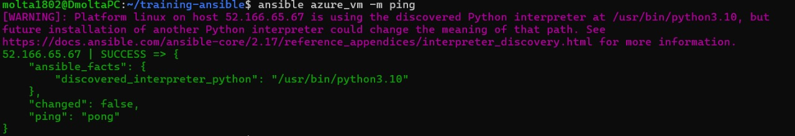
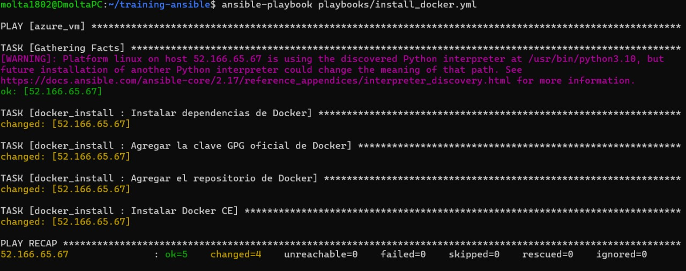
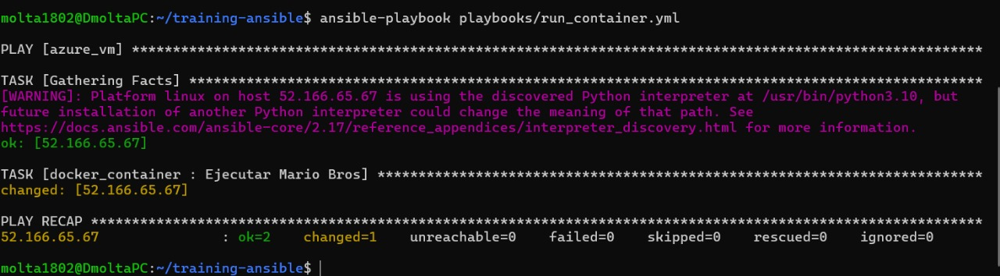
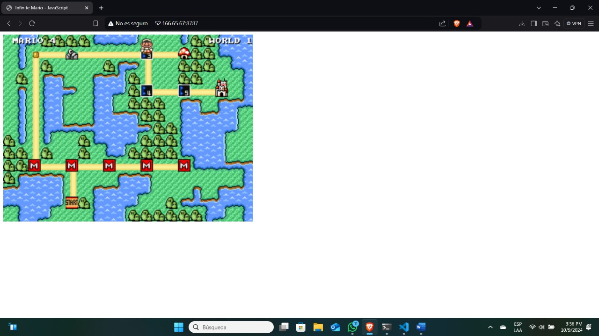

# 📝 Informe de Aprovisionamiento y Despliegue con Ansible
## 🌐 Descripción General
En este proyecto, utilizamos Ansible para aprovisionar una máquina virtual previamente creada con Terraform en Azure. El objetivo fue instalar Docker y desplegar el juego clásico Super Mario Bros en un contenedor, permitiendo que el juego sea accesible desde un navegador web en la nube.

## Herramientas Utilizadas
Terraform: Para aprovisionar la infraestructura en Azure.
Ansible: Para automatizar la configuración de la máquina virtual y desplegar la aplicación.
Docker: Para contenerizar la aplicación del juego y ejecutarla en la máquina virtual.
## 🔧 Pasos Realizados
## 1️⃣ Aprovisionamiento de la Máquina Virtual con Ansible
Usamos Ansible para verificar la conexión con la máquina virtual y luego instalar Docker y ejecutar el contenedor con el juego de Super Mario Bros. Los siguientes comandos fueron ejecutados para estos propósitos:

Verificar la conectividad con la máquina virtual:

´´´ansible azure_vm -m ping´´´

Instalar Docker en la máquina virtual:

´´´ansible-playbook playbooks/install_docker.yml´´´

Desplegar el contenedor con el juego de Super Mario Bros:

´´´ansible-playbook playbooks/run_container.yml´´´

## 2️⃣ Acceso al Juego en la Nube
Después de completar la configuración, accedimos al juego Super Mario Bros directamente desde un navegador web utilizando la IP pública de la máquina virtual. El juego fue exitosamente desplegado en la nube:

## 🎮 Conclusión
La combinación de Terraform y Ansible simplificó significativamente el proceso de aprovisionamiento y configuración. Terraform gestionó la infraestructura, mientras que Ansible automatizó la instalación y configuración del software, permitiendo el despliegue rápido de la aplicación en la nube. 
